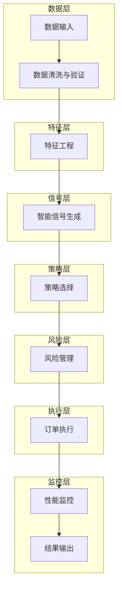
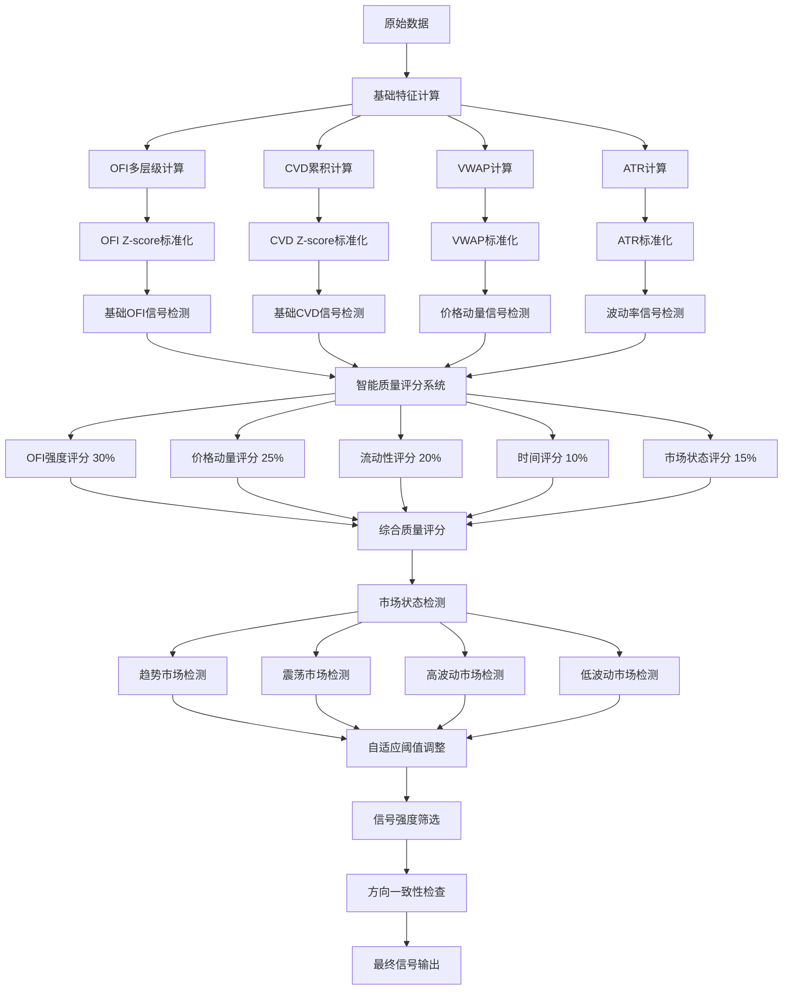
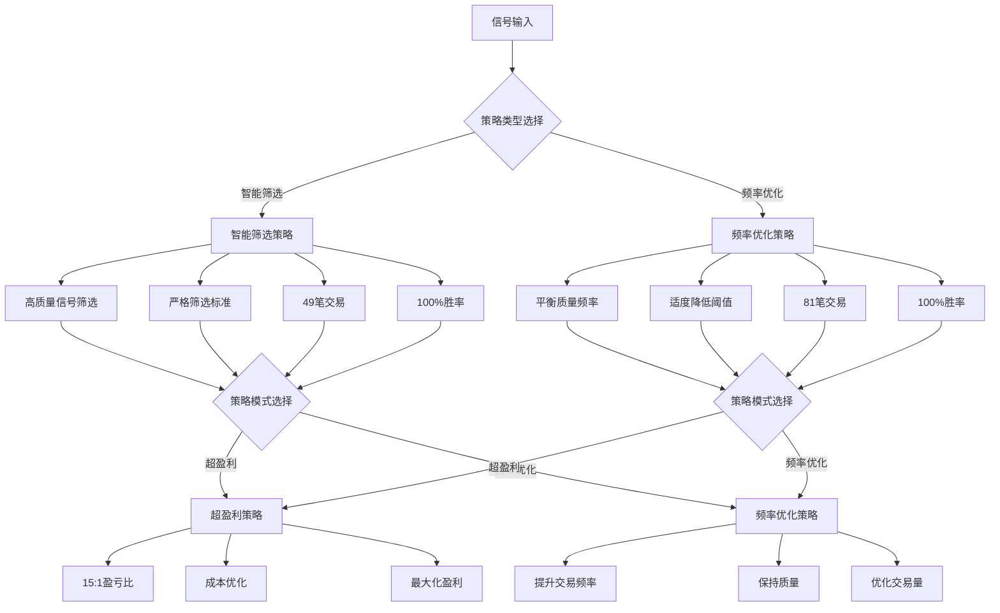
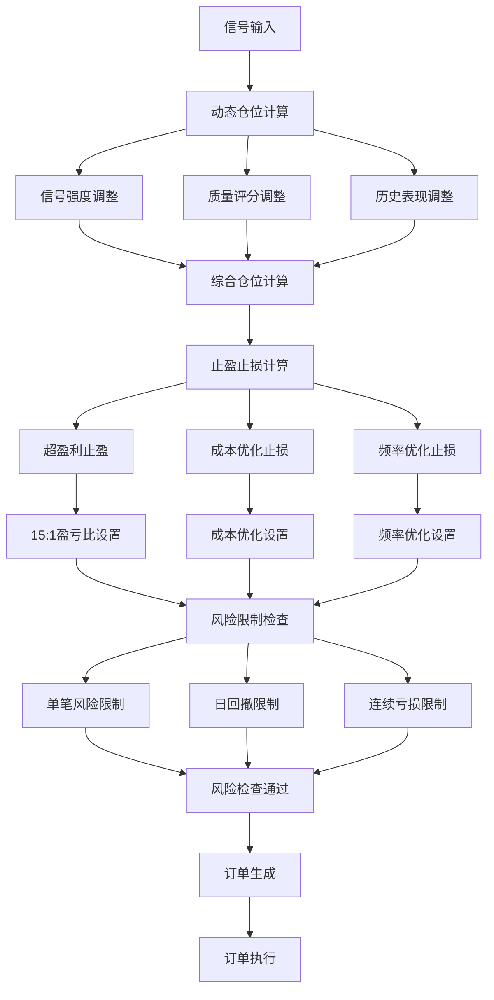
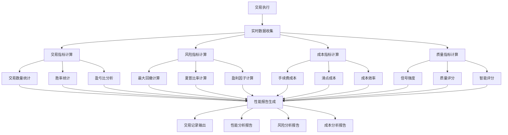
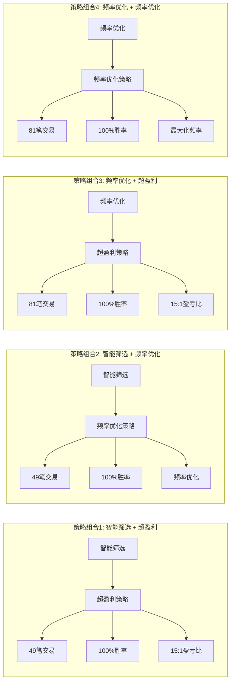
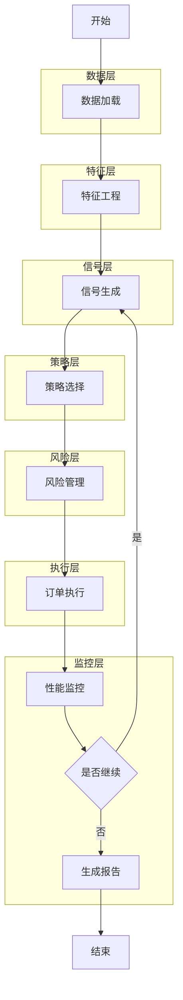
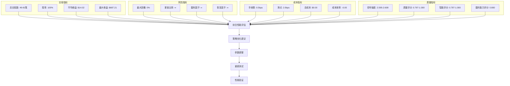

# V8.0 业务流程图 - Mermaid可视化

## 🔄 完整系统架构流程图

## 🎯 智能信号生成详细流程

## 🔧 策略组合选择流程

## 🛡️ 风险管理详细流程

## 📊 性能监控流程

## 🎯 四种策略组合对比

## 🔄 完整业务循环流程

## 📈 性能指标监控仪表板

---

**文档生成时间**: 2024年12月19日  
**版本**: v8.0 智能交易系统  
**状态**: 流程图完整 ✅
