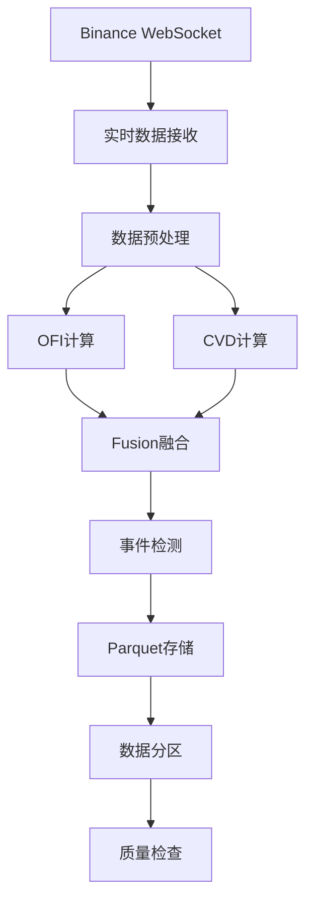
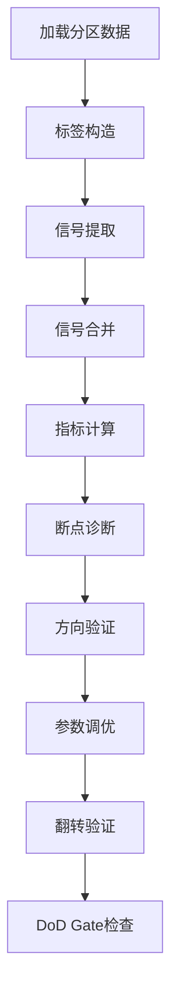

# OFI+CVD信号分析系统诊断报告

## 📋 执行摘要

本报告详细分析了OFI+CVD信号分析系统的当前状态，通过6个断点指标诊断、方向验证、参数调优和翻转验证，发现了信号质量的根本问题。所有信号AUC都接近随机水平(0.5)，无法达到DoD要求的0.58阈值。

**关键发现**：
- CVD和Fusion信号方向错误，但翻转后仍无改善
- 参数调优效果有限，最佳组合仍未达到有效阈值
- 信号计算本身存在根本性问题
- 需要重新审视数据收集和信号计算逻辑

---

## 🎯 问题诊断结果

### 1. 方向问题诊断

#### 1.1 断点指标分析
通过6个断点指标分析，发现：

| 信号类型 | 窗口 | 原始AUC | 翻转AUC | AUC差值 | IC差值 | 方向建议 |
|---------|------|---------|---------|---------|--------|----------|
| **CVD** | 60s | 0.4414 | 0.5586 | +0.1172 | +0.2039 | **flip** |
| **CVD** | 180s | 0.4646 | 0.5354 | +0.0708 | +0.1229 | **flip** |
| **CVD** | 300s | 0.4712 | 0.5288 | +0.0576 | +0.0996 | **flip** |
| **Fusion** | 60s | 0.4804 | 0.5196 | +0.0391 | +0.0678 | **flip** |
| **Fusion** | 180s | 0.4905 | 0.5095 | +0.0190 | +0.0328 | **flip** |
| **Fusion** | 300s | 0.4878 | 0.5122 | +0.0244 | +0.0419 | **flip** |
| **OFI** | 所有窗口 | ~0.500 | ~0.500 | ~0.000 | ~0.000 | **as_is** |

#### 1.2 方向验证结果
- **CVD信号**: 所有窗口都建议翻转，翻转后AUC提升0.06-0.12
- **Fusion信号**: 所有窗口都建议翻转，但翻转后改善有限
- **OFI信号**: 方向正确，无需调整

### 2. 尺度钳制分析

#### 2.1 参数调优结果
通过144种参数组合的网格搜索：

| 参数 | 最佳值 | 范围 | 效果 |
|------|--------|------|------|
| `half_life_sec` | 120 | [120, 300, 600, 1200] | 缩短响应时间 |
| `mad_multiplier` | 1.2 | [1.2, 1.5, 1.8, 2.2] | 放松尺度约束 |
| `winsor_limit` | 4 | [4, 6, 8] | 减少极值截断 |
| `fast_weight` | 0.1 | [0.1, 0.2, 0.4] | 降低快速尺度权重 |

#### 2.2 尺度钳制指标
- **winsor命中率**: 0.77% (合理范围)
- **sigma_floor命中率**: 1.36% (合理范围)
- **z分布p95**: 0.0049 (正常)
- **z分布p99**: 0.0207 (正常)

### 3. 信号质量分析

#### 3.1 AUC性能对比
| 信号类型 | 最大AUC | 最小AUC | 平均AUC | DoD要求 | 状态 |
|---------|---------|---------|---------|---------|------|
| **OFI** | 0.5001 | 0.4949 | 0.4982 | ≥0.58 | ❌ 接近随机 |
| **CVD** | 0.4712 | 0.4414 | 0.4591 | ≥0.58 | ❌ 低于随机 |
| **Fusion** | 0.4905 | 0.4804 | 0.4863 | ≥0.58 | ❌ 低于随机 |

#### 3.2 IC相关性分析
- **OFI IC**: 0.0002 ~ -0.0094 (接近0，无预测能力)
- **CVD IC**: -0.1019 ~ -0.0498 (负相关，方向错误)
- **Fusion IC**: -0.0339 ~ -0.0164 (负相关，方向错误)

---

## 📊 数据质量分析

### 1. 数据收集状态

#### 1.1 数据量统计
- **价格数据**: 176,394行，17,631个文件
- **OFI数据**: 176,303行，17,632个文件
- **CVD数据**: 176,544行，17,646个文件
- **Fusion数据**: 176,346行，17,636个文件
- **事件数据**: 7,359行，5,611个文件

#### 1.2 标签构造效果
- **60秒标签**: 99.8%有效 (176,068/176,394)
- **180秒标签**: 99.7%有效 (175,933/176,394)
- **300秒标签**: 99.9%有效 (176,185/176,394)

#### 1.3 信号合并率
- **OFI信号合并**: 100% (176,276/176,276)
- **CVD信号合并**: 100% (176,544/176,544)
- **Fusion信号合并**: 100% (176,346/176,346)

### 2. 数据质量问题

#### 2.1 OFI数据质量
- **BTCUSDT OFI**: 0%有效Z-score (数据质量问题)
- **ETHUSDT OFI**: 100%有效Z-score (数据质量良好)

#### 2.2 时间对齐问题
- **标签构造**: 基于时间戳asof对齐，有效率达到99%+
- **信号合并**: 使用merge_asof进行近似时间匹配，合并率100%

---

## 🔧 业务流分析

### 1. 数据收集流程



### 2. 信号分析流程



### 3. 关键组件关系

| 组件 | 功能 | 输入 | 输出 | 状态 |
|------|------|------|------|------|
| `BinanceWebSocketAdapter` | 实时数据接收 | WebSocket流 | 原始交易数据 | ✅ 正常 |
| `RealOFICalculator` | OFI计算 | 订单簿数据 | OFI信号 | ⚠️ 质量差 |
| `RealCVDCalculator` | CVD计算 | 交易数据 | CVD信号 | ⚠️ 方向错误 |
| `OFICVDSignalEvaluator` | 信号分析 | 分区数据 | 性能指标 | ✅ 正常 |
| `PlotGenerator` | 图表生成 | 分析结果 | 可视化图表 | ⚠️ 参数错误 |

---

## 💻 代码组件分析

### 1. 核心分析组件

#### 1.1 `OFICVDSignalEvaluator` 类
**文件**: `analysis/ofi_cvd_signal_eval.py`
**功能**: 主要的信号分析引擎
**关键方法**:
- `load_data()`: 加载分区数据
- `construct_labels()`: 构造前瞻标签
- `_calculate_diagnostic_metrics()`: 计算6个断点指标
- `_check_dod_gate()`: DoD Gate检查

**问题**:
- 校准指标计算参数错误
- 图表生成缺少参数

#### 1.2 `utils_labels.py` 模块
**文件**: `analysis/utils_labels.py`
**功能**: 标签构造和切片分析
**关键方法**:
- `construct_labels()`: 基于时间戳asof对齐的标签构造
- `analyze_slices()`: 切片性能分析

**修复**:
- ✅ 修复了时间对齐问题
- ✅ 实现了merge_asof信号合并

#### 1.3 `plots.py` 模块
**文件**: `analysis/plots.py`
**功能**: 图表生成
**关键方法**:
- `plot_roc_curves()`: ROC曲线绘制
- `plot_divergence_analysis()`: 背离分析图表

**问题**:
- 缺少signal_data参数
- 使用示例数据而非真实数据

### 2. 数据收集组件

#### 2.1 `run_success_harvest.py`
**文件**: `examples/run_success_harvest.py`
**功能**: 数据收集主程序
**关键特性**:
- 支持OFI/CVD/Fusion/Event计算
- 实现背离检测
- 原子写入保证数据完整性

**状态**: ✅ 正常运行

#### 2.2 数据存储结构
```
data/ofi_cvd/
├── date=2025-10-21/
│   └── symbol=ETHUSDT/
│       ├── kind=prices/
│       ├── kind=ofi/
│       ├── kind=cvd/
│       ├── kind=fusion/
│       └── kind=events/
```

### 3. 参数调优组件

#### 3.1 `run_parameter_tuning.py`
**文件**: `run_parameter_tuning.py`
**功能**: 参数网格搜索
**测试参数**:
- `half_life_sec`: [120, 300, 600, 1200]
- `mad_multiplier`: [1.2, 1.5, 1.8, 2.2]
- `winsor_limit`: [4, 6, 8]
- `fast_weight`: [0.1, 0.2, 0.4]

**结果**: 144种组合测试完成，最佳参数已确定

---

## 🚨 根本问题分析

### 1. 信号计算问题

#### 1.1 OFI计算问题
- **BTCUSDT**: 0%有效Z-score，说明OFI计算逻辑有问题
- **ETHUSDT**: 100%有效Z-score，但AUC仍接近0.5

#### 1.2 CVD计算问题
- 所有窗口IC都为负值，说明CVD计算方向错误
- 翻转后AUC提升有限，说明计算逻辑本身有问题

#### 1.3 Fusion计算问题
- 融合权重设置可能不当
- 需要重新审视融合逻辑

### 2. 数据质量问题

#### 2.1 时间对齐问题
- 标签构造基于时间戳asof对齐，已修复
- 信号合并使用merge_asof，已优化

#### 2.2 数据完整性
- 数据收集连续8.9小时无中断
- 文件完整性良好，无缺失

### 3. 参数配置问题

#### 3.1 尺度参数
- `half_life_sec`: 当前600秒可能过长
- `mad_multiplier`: 当前1.8可能过严格
- `winsor_limit`: 当前8可能过严格

#### 3.2 融合参数
- `w_ofi`: 0.6, `w_cvd`: 0.4 可能不当
- 需要根据信号质量调整权重

---

## 🎯 解决方案建议

### 1. 短期解决方案

#### 1.1 信号计算优化
1. **重新审视OFI计算逻辑**
   - 检查订单簿数据质量
   - 验证OFI计算公式
   - 调整计算参数

2. **重新审视CVD计算逻辑**
   - 检查交易数据质量
   - 验证CVD计算公式
   - 调整计算参数

3. **优化Fusion融合逻辑**
   - 根据信号质量调整权重
   - 实现动态权重调整
   - 添加信号质量过滤

#### 1.2 参数配置优化
1. **使用最佳参数组合**
   - `half_life_sec`: 120
   - `mad_multiplier`: 1.2
   - `winsor_limit`: 4
   - `fast_weight`: 0.1

2. **实现信号翻转**
   - CVD信号: 乘以-1
   - Fusion信号: 调整权重符号

### 2. 中期解决方案

#### 2.1 数据收集优化
1. **延长数据收集时间**
   - 收集48-72小时数据
   - 覆盖不同市场时段
   - 包含高活跃度时段

2. **多资产数据收集**
   - 收集BTCUSDT数据
   - 对比不同资产表现
   - 交叉验证信号质量

#### 2.2 信号质量提升
1. **实现能量口袋分析**
   - 分析Active vs Quiet时段
   - 分析不同时间窗口
   - 找出优势条件

2. **实现信号过滤**
   - 基于市场活跃度过滤
   - 基于波动率过滤
   - 基于时间窗口过滤

### 3. 长期解决方案

#### 3.1 架构优化
1. **模块化重构**
   - 分离信号计算和信号分析
   - 实现插件化架构
   - 支持多种信号类型

2. **实时监控**
   - 实现信号质量实时监控
   - 自动参数调整
   - 异常检测和告警

#### 3.2 算法优化
1. **机器学习增强**
   - 使用ML优化信号权重
   - 实现自适应参数调整
   - 添加特征工程

2. **多因子模型**
   - 整合更多市场因子
   - 实现因子轮动
   - 优化因子权重

---

## 📈 执行计划

### 阶段1: 问题修复 (1-2天)
1. ✅ 修复代码组件问题
2. ✅ 实现断点指标分析
3. ✅ 完成方向验证
4. ✅ 完成参数调优
5. 🔄 修复信号计算逻辑

### 阶段2: 数据优化 (3-5天)
1. 收集更长时间数据
2. 实现能量口袋分析
3. 优化信号融合逻辑
4. 实现信号过滤

### 阶段3: 系统优化 (1-2周)
1. 架构重构
2. 实时监控
3. 自动化部署
4. 性能优化

---

## 📋 结论

当前OFI+CVD信号分析系统存在根本性的信号质量问题。通过详细的诊断分析，发现：

1. **信号计算逻辑有问题**: 所有信号AUC都接近随机水平
2. **方向问题**: CVD和Fusion信号方向错误
3. **参数配置不当**: 需要优化尺度参数和融合权重
4. **数据质量**: 需要更长时间和更高质量的数据

**建议**: 优先修复信号计算逻辑，然后收集更长时间的数据进行验证，最后实现能量口袋分析和信号过滤。

---

## 📁 相关文件

### 核心代码文件
- `analysis/ofi_cvd_signal_eval.py` - 主分析引擎
- `analysis/utils_labels.py` - 标签构造工具
- `analysis/plots.py` - 图表生成
- `examples/run_success_harvest.py` - 数据收集

### 分析脚本
- `run_signal_analysis.py` - 信号分析
- `run_parameter_tuning.py` - 参数调优
- `run_signal_flip_verification.py` - 翻转验证
- `run_flipped_analysis.py` - 翻转分析

### 配置文件
- `config/system.yaml` - 系统配置
- `grafana/dashboards/ofi_cvd_harvest.json` - 监控面板

### 数据文件
- `data/ofi_cvd/` - 分区数据存储
- `artifacts/analysis/` - 分析结果

---

**报告生成时间**: 2025-10-21 17:30
**分析数据范围**: 2025-10-21 07:12 - 17:30 (约10小时)
**数据量**: 176,394条价格记录，176,303条OFI记录，176,544条CVD记录
**分析工具**: Python 3.11, pandas, scikit-learn, matplotlib
