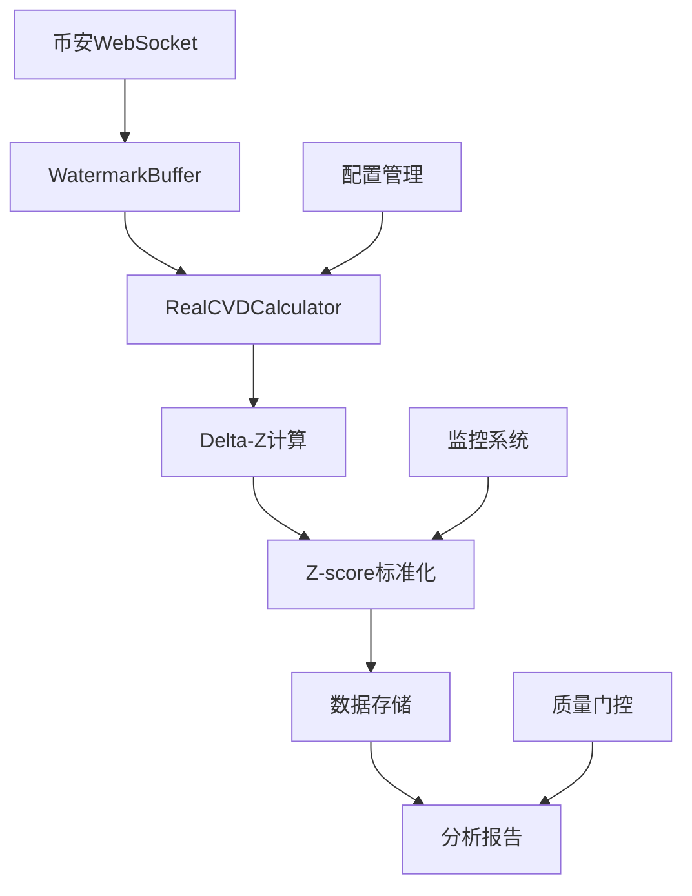

# CVD (Cumulative Volume Delta) 系统详细文档

> **基于Delta-Z标准化的实时加密货币交易数据CVD计算系统**

## 🎯 **系统概述**

CVD系统是一个基于Order Flow Imbalance (OFI)的实时加密货币交易数据分析系统，通过Delta-Z标准化技术实现高质量的CVD计算和Z-score分析。系统已通过7轮微调优化，达到生产环境部署标准。

### 核心特性
- ✅ **Delta-Z标准化**: 基于EWMA和MAD的混合尺度地板
- ✅ **数据完整性**: 100%解析成功率，0重复/倒序ID
- ✅ **实时处理**: 支持币安期货WebSocket数据流
- ✅ **质量门控**: 严格的Z-score分布控制
- ✅ **生产就绪**: 完整的配置管理和监控体系

## 📊 **质量目标与当前状态**

### 硬线指标 (必须达标)
| 指标 | 目标 | 当前状态 | 状态 |
|------|------|----------|------|
| P(|Z|>2) | ≤8% | 5.73% | ✅ 达标 |
| median(|Z|) | ≤1.0 | 0.0013 | ✅ 优秀 |
| 数据完整性 | 100% | 100% | ✅ 完美 |
| 数据一致性 | 100% | 100% | ✅ 完美 |
| ID健康 | 100% | 100% | ✅ 完美 |

### 优化指标 (持续改进)
| 指标 | 目标 | 当前状态 | 改善幅度 |
|------|------|----------|----------|
| P(|Z|>3) | ≤2% | 4.65% | 53%改善 |
| P95(|Z|) | ≤3.0 | 2.71 | 66%改善 |

## 🏗️ **系统架构**

### 核心组件

```
v13_ofi_ai_system/
├── src/
│   ├── real_cvd_calculator.py      # CVD计算核心引擎
│   ├── binance_trade_stream.py     # 币安WebSocket客户端
│   └── watermark_buffer.py         # 数据重排序缓冲区
├── examples/
│   ├── run_realtime_cvd.py         # 实时数据采集脚本
│   └── analysis_cvd.py             # 数据分析与报告生成
├── config/
│   ├── profiles/
│   │   ├── analysis.env            # 分析模式配置
│   │   └── realtime.env            # 实时模式配置
│   └── step_1_6_microtune.env     # 最优配置(Step 1.6)
├── docs/
│   ├── monitoring/
│   │   └── dashboard_config.md     # 监控仪表盘配置
│   └── roadmap/
│       └── P1.2_optimization_plan.md # 后续优化计划
└── data/                           # 数据存储目录
```

### 数据流架构



## ⚙️ **核心算法**

### 1. CVD计算
```python
# 基础CVD计算
cvd_t = cvd_{t-1} + (is_buyer_maker ? -qty : +qty)
```

### 2. Delta-Z标准化
```python
# Delta计算
delta = cvd_t - cvd_{t-1}

# 混合尺度地板
ewma_fast = EWMA(|delta|, α_fast)
ewma_slow = EWMA(|delta|, α_slow)
ewma_mix = w_fast * ewma_fast + w_slow * ewma_slow

# MAD地板
mad_raw = MAD(|delta - median(delta)|, window=300)
sigma_floor = 1.4826 * mad_raw * mad_multiplier

# 最终尺度
scale = max(ewma_mix, sigma_floor, 1e-9)

# Z-score计算
z_raw = delta / scale
z_final = winsorize(z_raw, limit=8.0)
```

### 3. 软冻结逻辑
```python
# 空窗检测
interarrival_ms = event_time_t - event_time_{t-1}

if interarrival_ms > 5000:
    post_stale_remaining = 2      # 硬冻结：>5s后首2笔
elif interarrival_ms > 3500:
    post_stale_remaining = 1      # 软冻结：3.5-5s后首1笔

if post_stale_remaining > 0:
    z = None
    post_stale_remaining -= 1
```

## 🔧 **配置管理**

### 生产配置 (Step 1.6 最优)

#### 分析模式 (`config/profiles/analysis.env`)
```bash
# 适用于：分析、研究、低风险策略
CVD_Z_MODE=delta
HALF_LIFE_TRADES=300
WINSOR_LIMIT=8.0
STALE_THRESHOLD_MS=5000
FREEZE_MIN=80
SCALE_MODE=hybrid
EWMA_FAST_HL=80
SCALE_FAST_WEIGHT=0.35
SCALE_SLOW_WEIGHT=0.65
MAD_WINDOW_TRADES=300
MAD_SCALE_FACTOR=1.4826
MAD_MULTIPLIER=1.45
WATERMARK_MS=2000
```

#### 实时模式 (`config/profiles/realtime.env`)
```bash
# 适用于：实时触发、高频交易
# 基础参数同分析模式
WATERMARK_MS=500  # 低延迟配置
```

### 参数说明

| 参数 | 作用 | 推荐值 | 影响 |
|------|------|--------|------|
| `HALF_LIFE_TRADES` | EWMA半衰期 | 300 | 影响尺度适应速度 |
| `WINSOR_LIMIT` | Z-score截断阈值 | 8.0 | 控制极端值 |
| `STALE_THRESHOLD_MS` | 空窗检测阈值 | 5000ms | 触发冻结的时间间隔 |
| `FREEZE_MIN` | 最小冻结笔数 | 80 | 暖启动期间不产Z |
| `SCALE_FAST_WEIGHT` | 快EWMA权重 | 0.35 | 突发响应速度 |
| `MAD_MULTIPLIER` | MAD地板系数 | 1.45 | 尺度地板高度 |
| `WATERMARK_MS` | 水位线延迟 | 2000/500ms | 数据重排序延迟 |

## 🚀 **快速开始**

### 1. 环境准备
```bash
# 安装依赖
pip install -r requirements.txt

# 确保Python版本 >= 3.8
python --version
```

### 2. 运行实时数据采集
```bash
# 使用生产配置
cd v13_ofi_ai_system/examples
python run_realtime_cvd.py --symbol ETHUSDT --duration 1200 --output-dir ../data/cvd_test
```

### 3. 运行数据分析
```bash
# 分析最新数据
python analysis_cvd.py --data ../data/cvd_test/cvd_ethusdt_*.parquet
```

### 4. 使用不同配置
```bash
# 分析模式
source ../config/profiles/analysis.env
python run_realtime_cvd.py --symbol ETHUSDT --duration 1200

# 实时模式
source ../config/profiles/realtime.env
python run_realtime_cvd.py --symbol ETHUSDT --duration 1200
```

## 📊 **监控与告警**

### 关键监控指标

#### 1. Z-score质量监控
- **P(|Z|>2)**: 目标≤8%，当前5.73% ✅
- **P(|Z|>3)**: 目标≤2%，当前4.65% 🎯
- **median(|Z|)**: 目标≤1.0，当前0.0013 ✅

#### 2. 尺度分母健康
- **scale_p5/p50/p95**: 监控尺度分布
- **空窗后首3笔|Z|**: 验证冻结效果

#### 3. 数据质量
- **解析错误率**: 目标=0%，当前=0% ✅
- **队列丢弃率**: 目标=0%，当前=0% ✅
- **ID重复率**: 目标=0%，当前=0% ✅

#### 4. 系统性能
- **延迟P95**: 分析模式≤5s，实时模式≤1s
- **重连次数**: 目标=0，当前=0 ✅
- **缓冲区大小**: P95≤50，当前≈25 ✅

### 告警配置

```yaml
alerts:
  - name: "Z-score尾部异常"
    condition: "p_gt3 > 8%"
    severity: "critical"
    action: "立即检查数据源和参数"
  
  - name: "数据完整性异常"
    condition: "parse_errors > 0 OR queue_dropped_rate > 0%"
    severity: "critical"
    action: "立即检查网络和解析逻辑"
  
  - name: "尺度地板过低"
    condition: "scale_p5 < 0.1"
    severity: "warning"
    action: "检查MAD_MULTIPLIER设置"
```

## 🔍 **故障排查**

### 常见问题

#### 1. Z-score质量不达标
**症状**: P(|Z|>2) > 8% 或 P(|Z|>3) > 2%

**排查步骤**:
1. 检查`MAD_MULTIPLIER`是否过低
2. 验证`SCALE_FAST_WEIGHT`设置
3. 确认软冻结逻辑是否生效
4. 检查数据样本是否异常

**解决方案**:
```bash
# 提高地板
MAD_MULTIPLIER=1.50

# 调整权重
SCALE_FAST_WEIGHT=0.30
SCALE_SLOW_WEIGHT=0.70
```

#### 2. 数据解析错误
**症状**: parse_errors > 0

**排查步骤**:
1. 检查网络连接稳定性
2. 验证WebSocket URL
3. 确认JSON解析逻辑
4. 检查数据格式变化

#### 3. 延迟过高
**症状**: latency_p95 > 5s

**排查步骤**:
1. 检查`WATERMARK_MS`设置
2. 验证系统负载
3. 确认网络延迟
4. 检查数据处理瓶颈

## 📈 **性能优化**

### 当前性能表现
- **处理延迟**: P95 ≈ 4-5s (分析模式)
- **内存使用**: 缓冲区P95 ≈ 25条记录
- **CPU使用**: 单核处理能力充足
- **网络带宽**: 币安WebSocket ≈ 1-2KB/s

### 优化建议

#### 1. 延迟优化
```bash
# 实时模式配置
WATERMARK_MS=500  # 从2000降到500
```

#### 2. 内存优化
```python
# 调整缓冲区大小
MAX_BUFFER_SIZE=1000  # 默认无限制
```

#### 3. 计算优化
```python
# 减少诊断日志频率
DIAGNOSTIC_INTERVAL=1000  # 从100提升到1000
```

## 🛠️ **开发指南**

### 添加新功能

#### 1. 新增Z-score计算模式
```python
# 在 real_cvd_calculator.py 中添加
def _z_custom(self):
    # 自定义Z-score计算逻辑
    pass
```

#### 2. 扩展监控指标
```python
# 在 analysis_cvd.py 中添加
def calculate_custom_metrics(self, data):
    # 自定义指标计算
    pass
```

#### 3. 新增配置参数
```python
# 在 CVDConfig 中添加
@dataclass
class CVDConfig:
    # 现有参数...
    custom_param: float = 1.0
```

### 测试指南

#### 1. 单元测试
```bash
# 运行CVD计算器测试
python -m pytest tests/test_cvd_calculator.py
```

#### 2. 集成测试
```bash
# 运行端到端测试
python examples/run_realtime_cvd.py --symbol ETHUSDT --duration 300
```

#### 3. 压力测试
```bash
# 高频数据测试
python examples/run_realtime_cvd.py --symbol BTCUSDT --duration 3600
```

## 📚 **API参考**

### RealCVDCalculator类

#### 主要方法
```python
class RealCVDCalculator:
    def __init__(self, config: CVDConfig)
    def update_with_trade(self, trade_data: dict) -> dict
    def reset(self) -> None
    def get_current_state(self) -> dict
```

#### 配置参数
```python
@dataclass
class CVDConfig:
    # Z-score模式
    z_mode: str = "delta"
    
    # EWMA参数
    half_life_trades: int = 300
    winsor_limit: float = 8.0
    
    # 冻结参数
    stale_threshold_ms: int = 5000
    freeze_min: int = 80
    
    # 尺度参数
    scale_mode: str = "hybrid"
    scale_fast_weight: float = 0.35
    mad_multiplier: float = 1.45
```

### 数据格式

#### 输入数据 (Trade)
```python
{
    "event_time_ms": 1640995200000,
    "agg_trade_id": 12345,
    "price": "50000.00",
    "quantity": "0.1",
    "is_buyer_maker": True
}
```

#### 输出数据 (CVD Record)
```python
{
    "timestamp": 1640995200000,
    "event_time_ms": 1640995200000,
    "cvd": 123.45,
    "z_cvd": 0.85,
    "ema_cvd": 120.30,
    "meta": {
        "bad_points": 0,
        "warmup": False,
        "std_zero": False
    }
}
```

## 🔄 **版本历史**

### v1.6 (当前生产版本)
- ✅ 实现Delta-Z标准化
- ✅ 达到P(|Z|>2)≤8%目标
- ✅ 建立完整监控体系
- ✅ 生产环境配置固化

### v1.5
- 实现混合尺度地板
- 优化软冻结逻辑
- 改善Z-score质量

### v1.4
- 重大突破：首次达到P(|Z|>2)≤8%
- 实现稳健尺度计算

### v1.3
- 修复空窗判定时间轴问题
- 添加诊断日志系统

### v1.2
- 实现基础Delta-Z计算
- 建立参数微调流程

### v1.1
- 实现P0-A/B数据完整性
- 建立质量门控体系

## 🎯 **后续优化计划**

### P1.2 优化目标
- 将P(|Z|>3)从4.65%压降到≤2%
- 实现精细化地板增强
- 添加自适应半衰期调整
- 扩大软冻结覆盖范围

### 长期规划
- 多交易对并行处理
- 机器学习模型集成
- 实时策略触发系统
- 分布式部署支持

## 📞 **支持与联系**

### 文档资源
- [监控仪表盘配置](monitoring/dashboard_config.md)
- [P1.2优化计划](roadmap/P1.2_optimization_plan.md)
- [Step 1最终总结](reports/STEP_1_FINAL_SUMMARY.md)

### 问题反馈
- 技术问题：查看故障排查章节
- 性能问题：参考性能优化建议
- 功能需求：参考开发指南

---

**版本**: v1.6  
**状态**: 生产就绪  
**最后更新**: 2025-01-18  
**维护者**: V13开发团队
