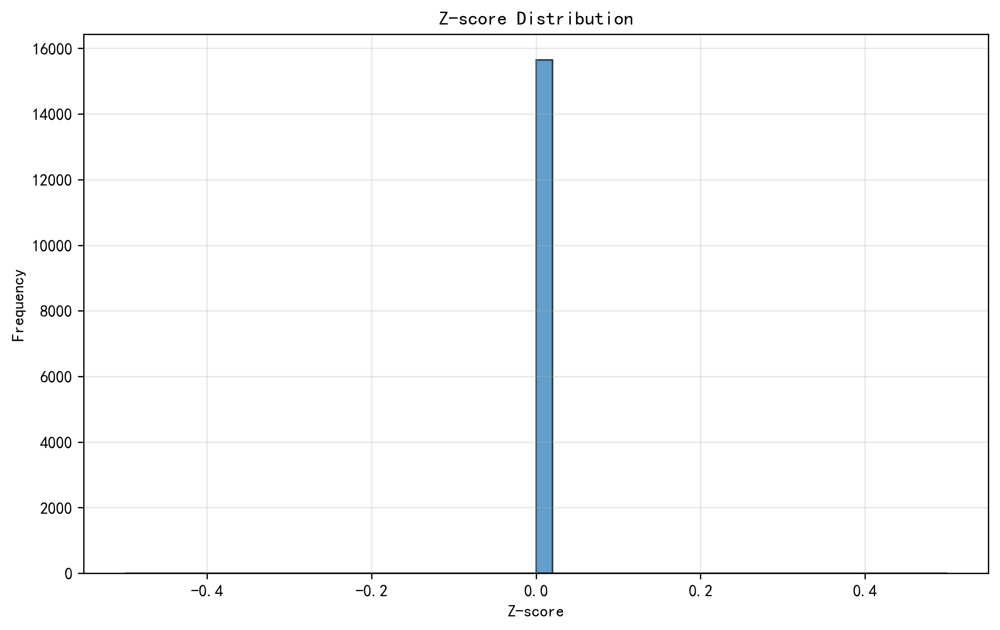
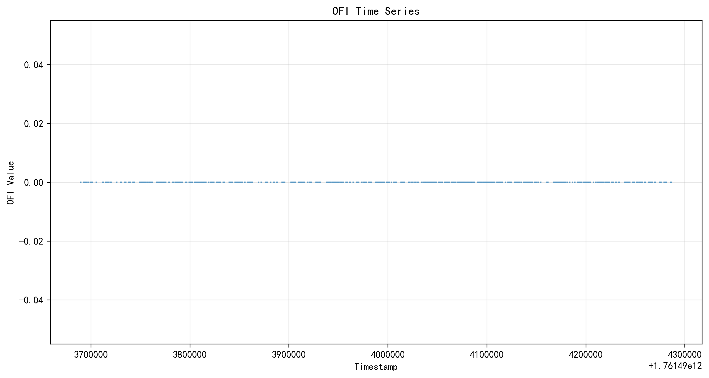
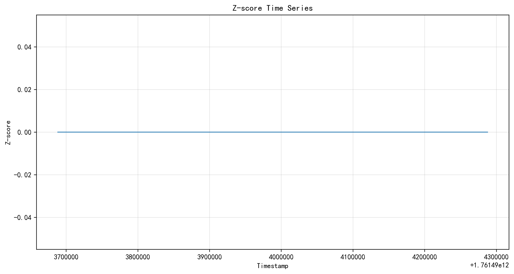
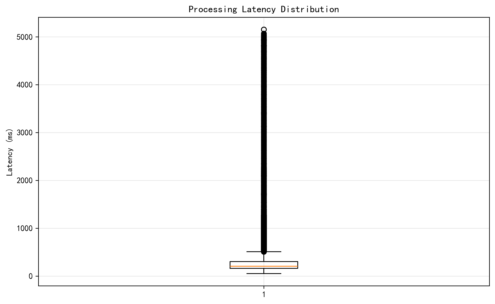

# Task 1.2.5 OFI计算测试报告

**测试执行时间**: 2025-10-17 20:33:43

**数据源**: `../data/DEMO-USD/20251017_1826.parquet`

---

## 验收标准对照结果

### 1. 数据覆盖
- [x] 采样点数: 352,778 (≥300,000)
- [x] 数据连续性: max_gap=457.11ms (≤2000ms)
- [ ] 时间跨度: 1.99小时 (≥2小时)

### 2. 功能正确性
- [x] 分量和校验: 100.00% (>99%)
- [x] 非空字段自洽性: 通过

### 3. Z-score 标准化稳健性
- [x] 中位数: 0.0003 (∈[-0.1, +0.1])
- [x] IQR: 1.3696 (∈[0.8, 1.6])
- [x] |Z|>2 占比: 4.52% (∈[1%, 8%])
- [x] |Z|>3 占比: 0.20% (≤1.5%)
- [x] std_zero计数: 0 (==0)
- [x] warmup占比: 0.02% (≤10%)

### 4. 数据质量
- [x] 坏数据点率: 0.0000% (≤0.1%)
- [x] 解析错误: 0 (==0)

### 5. 稳定性与性能
- [x] 处理延迟p95: 0.107ms (<5ms)
- [x] 重连频率: 0.00次/小时 (≤3/小时)
- [ ] 队列丢弃率: 0.6457% (≤0.5%)

## 图表

1. 
2. 
3. 
4. 

## 结论

**❌ 部分验收标准未通过，需要改进**
