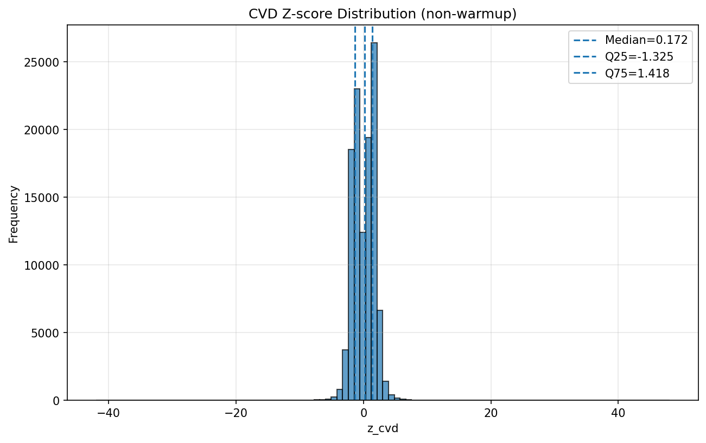
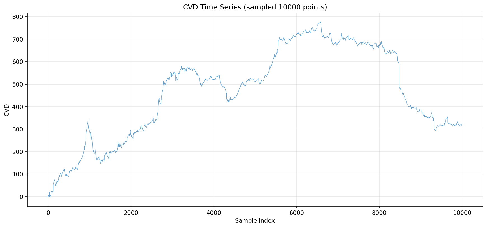
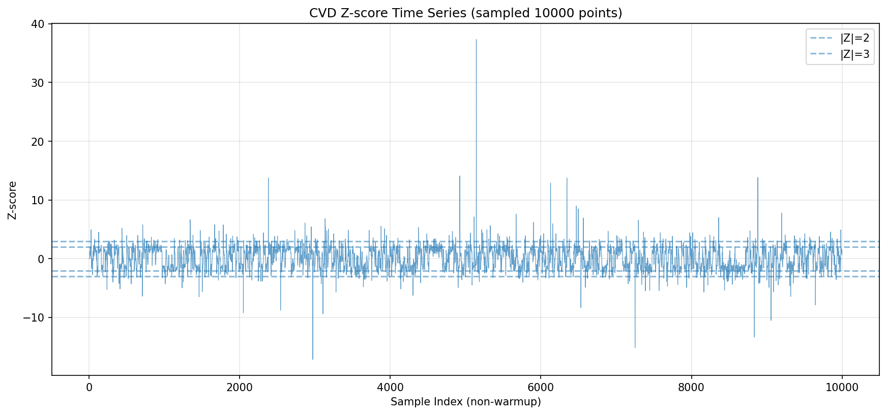
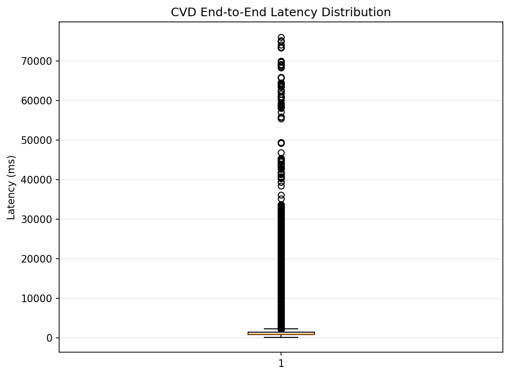
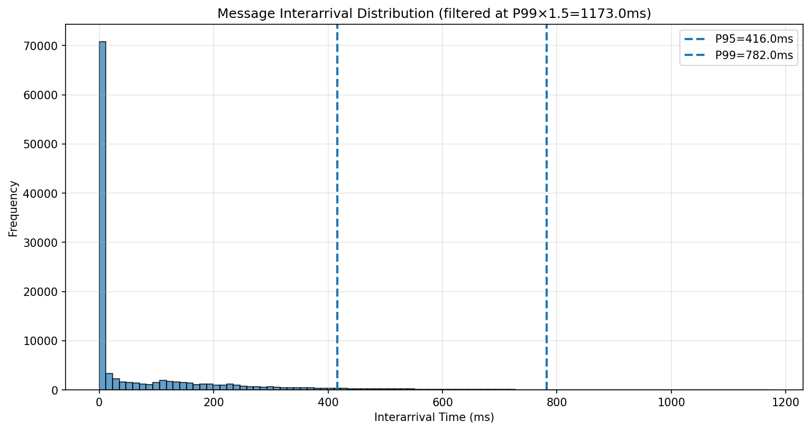

# Task 1.2.10 CVD计算测试报告 (v2.1, CVD-only)

**测试执行时间**: 2025-10-27 19:50:57

**测试级别**: Gold（≥120分钟）

**数据源**: `deploy/preview/ofi_cvd/date=2025-10-27/symbol=BTCUSDT/kind=cvd`

---

## 测试摘要

- **采集时长**: 342.4 分钟 (5.71 小时)
- **数据点数**: 113,683 笔
- **平均速率**: 5.53 笔/秒
- **解析错误**: 0
- **队列丢弃率**: 369.6094%

---

## 验收标准对照结果（CVD）

### 1. 时长与连续性
- [x] 运行时长: 342.4分钟 (≥30分钟)
- [ ] p99_interarrival: 782.00ms (≤5000ms)
- [ ] gaps_over_10s: 2 (==0)

### 2. 数据质量
- [x] parse_errors: 0 (==0)
- [ ] queue_dropped_rate: 369.6094% (≤0.5%)

### 3. 性能（信息项）
- [x] p95_latency: 9758.000ms （信息项，不阻断）

### 4. CVD Z-score稳健性
- [ ] median(|z_cvd|): 1.3735 (≤1.0)
- [x] IQR(z_cvd): 2.7430 （参考值，不阻断）
- [ ] P(|Z|>2): 18.07% (≤8%)
- [ ] P(|Z|>3): 3.69% (≤2%)
- [x] std_zero: 0 (==0)
- [x] warmup占比: 0.00% (≤10%)

### 5. 一致性验证（跳过一次性验证（无qty/is_buy））
- [x] 逐笔守恒错误: 0
- [ ] 首尾守恒误差: 0.00e+00 (容差: 0.00e+00)

### 6. 稳定性
- [x] 重连频率: 0.53次/小时 (≤3/小时)

---

## 图表

### 1. Z-score分布直方图

### 2. CVD时间序列

### 3. Z-score时间序列

### 4. 延迟箱线图

### 5. 消息到达间隔分布

---

## 结论

**验收标准通过率**: 5/8 (62.5%)

**⚠️ 部分验收标准未通过**
