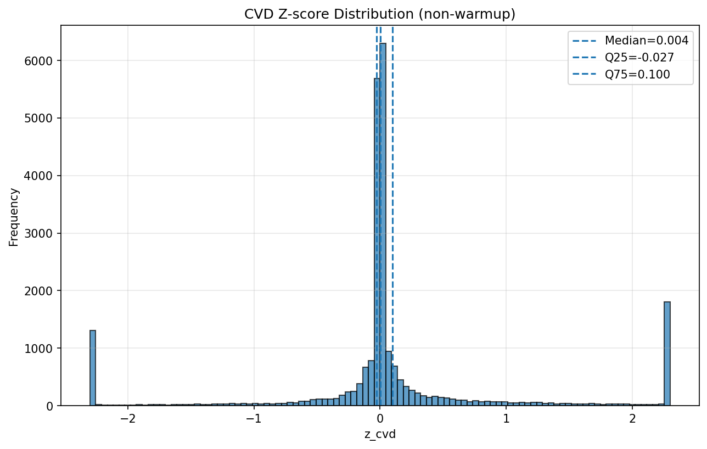
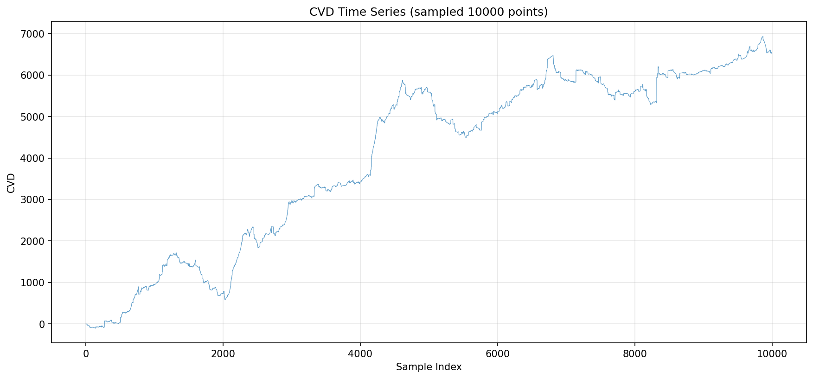
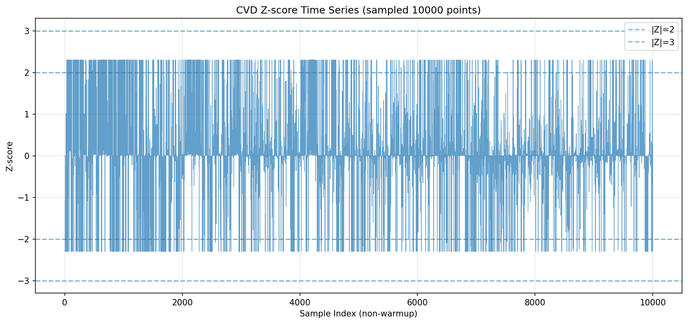
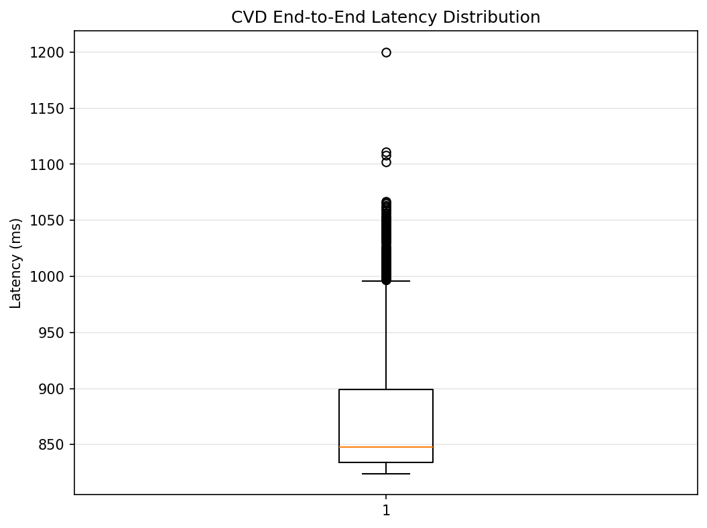
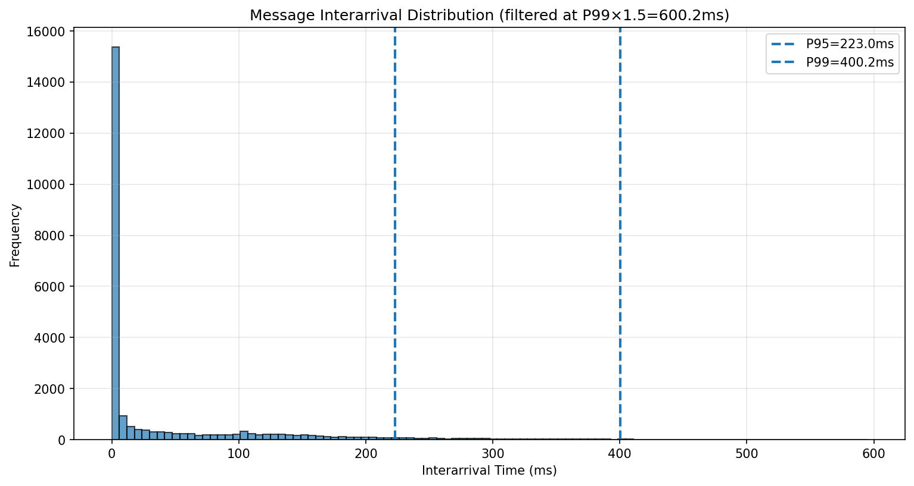

# Task 1.2.10 CVD计算测试报告 (v2.1, CVD-only)

**测试执行时间**: 2025-10-27 23:02:53

**测试级别**: Bronze（≥30分钟）

**数据源**: `v13_ofi_ai_system\deploy\_out\ofi_cvd_shadow\preview\ofi_cvd\date=2025-10-27\symbol=ETHUSDT\kind=cvd`

---

## 测试摘要

- **采集时长**: 18.0 分钟 (0.30 小时)
- **数据点数**: 24,686 笔
- **平均速率**: 22.87 笔/秒
- **解析错误**: 0
- **队列丢弃率**: 66.9489%

---

## 验收标准对照结果（CVD）

### 1. 时长与连续性
- [ ] 运行时长: 18.0分钟 (≥30分钟)
- [x] p99_interarrival: 400.16ms (≤5000ms)
- [x] gaps_over_10s: 0 (==0)

### 2. 数据质量
- [x] parse_errors: 0 (==0)
- [ ] queue_dropped_rate: 66.9489% (≤0.5%)

### 3. 性能（信息项）
- [x] p95_latency: 979.000ms （信息项，不阻断）

### 4. CVD Z-score稳健性
- [x] median(|z_cvd|): 0.0527 (≤1.0)
- [x] IQR(z_cvd): 0.1277 （参考值，不阻断）
- [ ] P(|Z|>2): 13.38% (≤8%)
- [x] P(|Z|>3): 0.00% (≤2%)
- [x] std_zero: 0 (==0)
- [x] warmup占比: 0.00% (≤10%)

### 5. 一致性验证（跳过一次性验证（无qty/is_buy））
- [x] 逐笔守恒错误: 0
- [ ] 首尾守恒误差: 0.00e+00 (容差: 0.00e+00)

### 6. 稳定性
- [x] 重连频率: 0.00次/小时 (≤3/小时)

---

## 图表

### 1. Z-score分布直方图

### 2. CVD时间序列

### 3. Z-score时间序列

### 4. 延迟箱线图

### 5. 消息到达间隔分布

---

## 结论

**验收标准通过率**: 5/8 (62.5%)

**⚠️ 部分验收标准未通过**
