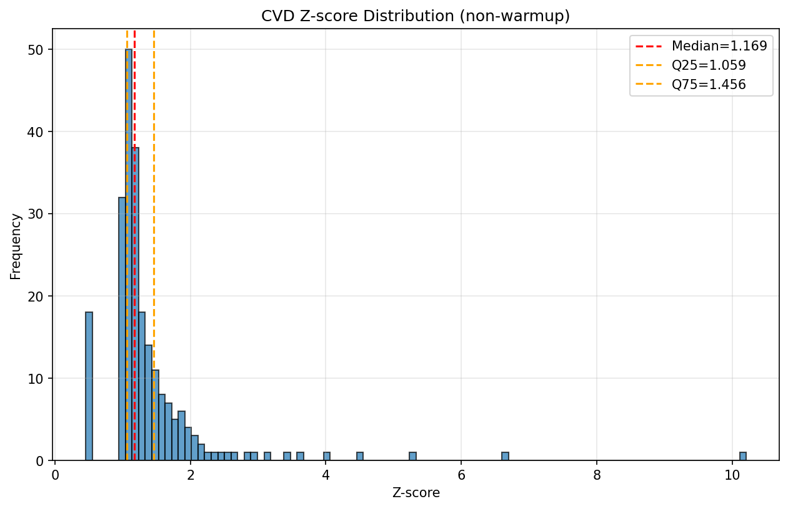
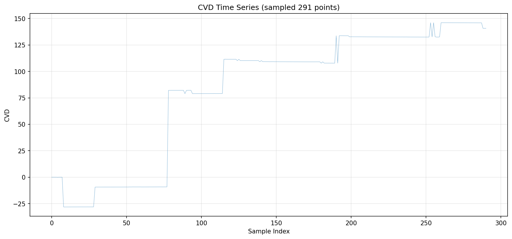
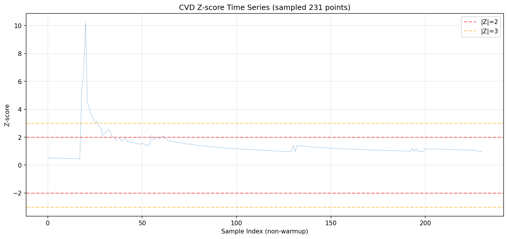
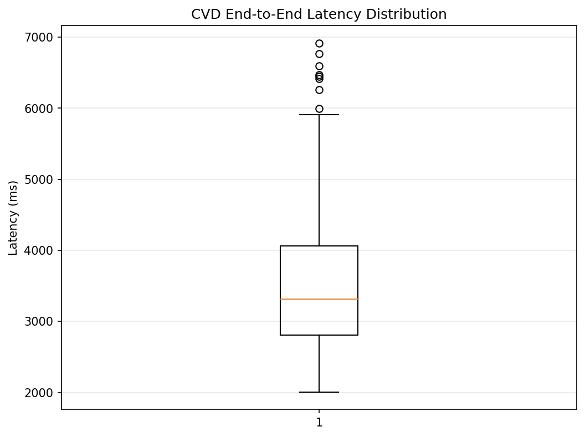
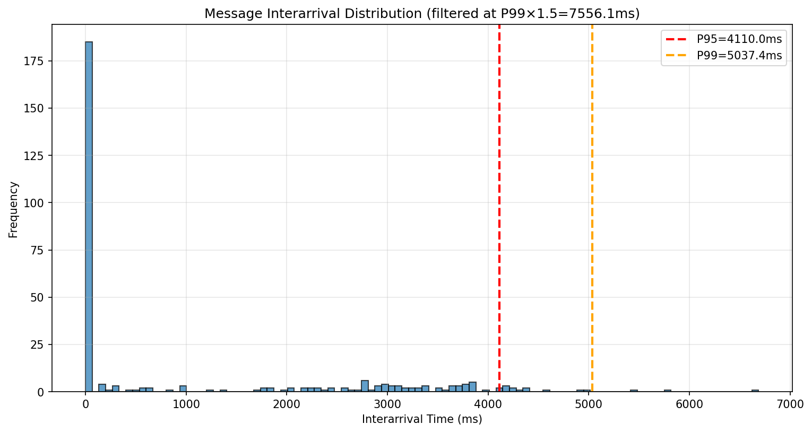
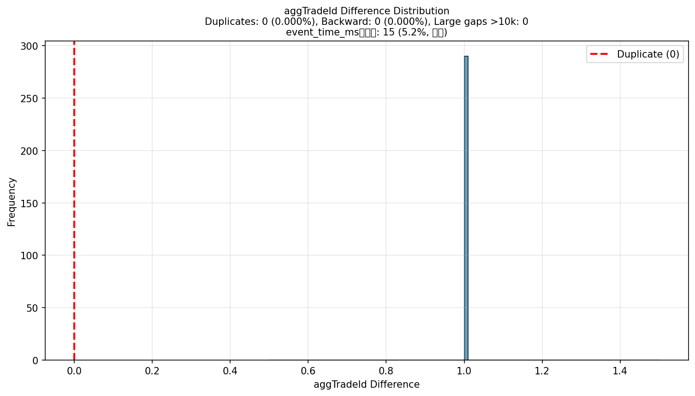

# Task 1.2.10 CVD计算测试报告

**测试执行时间**: 2025-10-18 04:46:20

**测试级别**: Gold（≥120分钟）

**数据源**: `../data/cvd_p0b_quick_test`

---

## 测试摘要

- **采集时长**: 4.9 分钟 (0.08 小时)
- **数据点数**: 291 笔
- **平均速率**: 1.00 笔/秒
- **解析错误**: 0
- **重连次数**: 0
- **队列丢弃率**: 0.0000%

---

## 验收标准对照结果

### 1. 时长与连续性
- [ ] 运行时长: 4.9分钟 (≥120分钟)
- [ ] max_gap_ms: 6686.64ms (≤2000ms)

### 2. 数据质量
- [x] parse_errors: 0 (==0)
- [x] queue_dropped_rate: 0.0000% (≤0.5%)

### 3. 性能指标
- [ ] p95_latency: 5535.024ms (<300ms)

### 4. Z-score稳健性
- [ ] median(|z_cvd|): 1.1689 (≤0.5)
- [ ] IQR(z_cvd): 0.3968 (∈[1.0, 2.0])
- [ ] P(|Z|>2): 9.09% (∈[1%, 8%])
- [ ] P(|Z|>3): 3.46% (<1%)
- [x] std_zero: 0 (==0)

### 5. 一致性验证（全量检查）
- [ ] 逐笔守恒: 0 错误 (容差≤1e-9)
- [ ] 首尾守恒误差: 6.00e-03 (≤1e-6)
- 检查样本: 291 笔 (全量)

### 6. 稳定性
- [x] 重连频率: 0.00次/小时 (≤3/小时)

---

## 图表

### 1. Z-score分布直方图

### 2. CVD时间序列

### 3. Z-score时间序列

### 4. 延迟箱线图

### 5. 消息到达间隔分布

**Interarrival统计**:
- P50: 0.0ms
- P95: 4110.0ms
- P99: 5037.4ms
- Max: 6686.6ms

### 6. Event ID差值分布

**aggTradeId检查**:
- 重复ID: 0 (0.000%)
- 倒序ID: 0 (0.000%)
- 大跳跃(>10k): 0
- event_time_ms同毫秒: 15 (5.2%, 信息项)

---

## 结论

**验收标准通过率**: 3/8 (37.5%)

**⚠️ 部分验收标准未通过**

需要关注的指标:
- ⚠️ 运行时长未达标
- ⚠️ 数据连续性未达标
- ⚠️ Z-score分布未达标
- ⚠️ CVD连续性验证未通过
